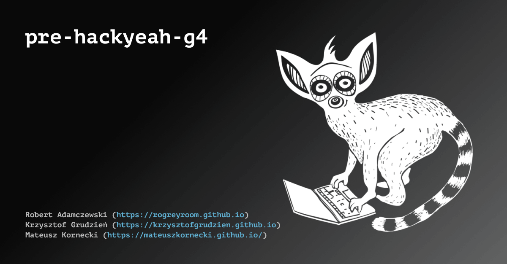

# git playground - WTF-04-teamwork

Robert Adamczewski,
Krzysztof Grudzień,
Mateusz Kornecki.

## Website 🚀

[go to the website](https://github.com/mateuszkornecki/WTF-04-teamwork)

## Build with

- [gulp-starter](https://github.com/rogreyroom/gulp-starter)

## Using gulp

- development - run `gulp` or `npm start`
- production - run `gulp build` or `npm run build`
- deployment - `npm run deploy` this will build and deploy to gh-pages

## Version

v.1.0.0

## Author

Robert Adamczewski, Krzysztof Grudzień, Mateusz Kornecki

## License

This project is licensed under MIT License - see the [LICENSE.md](./LICENSE.md) file for details.
